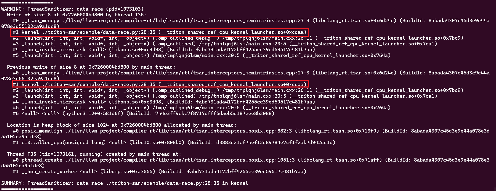
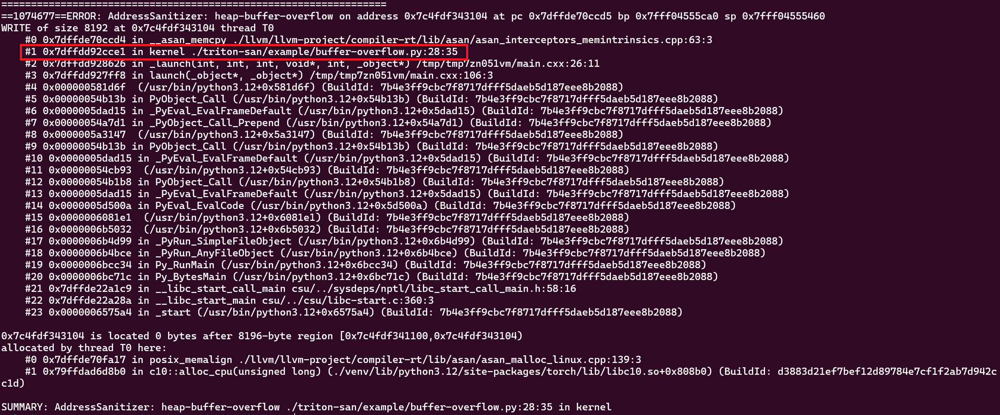
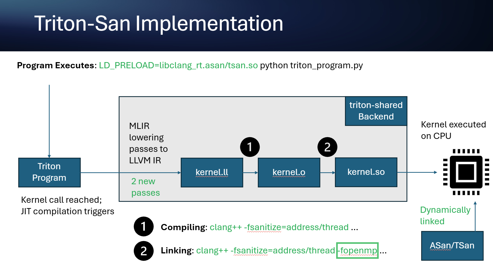

# TritonSan
TritonSan is a dynamic analysis tool that is capable of accurately detect software bugs (e.g., buffer overflow, data race) in Triton programs. 

TritonSan uses triton-shared, an open-source CPU backend maintained by Microsoft, to compile Triton kernels into CPU executables. During this compilation process, TritonSan enables instrumentions for LLVM sanitizers and applies the necessary transformations to ensure they receive complete debug information. When the Triton kernel executes, it runs alongside the specified LLVM sanitizer, enabling accurate detection of software bugs within the kernel.

## Table of Contents
1. [Installation](#llvm-sanitizer-feature-introduction)
2. [Usage](#usage)
3. [Example](#example)
4. [Known Issues](#known-issues)
5. [How TritonSan works](#an-overview-of-the-tritonsan-workflow)

## Install TritonSan
Because the prebuilt LLVM downloaded by Triton’s `setup.py` excludes LLVM sanitizers (i.e., the compiler-rt subproject is disabled), we need to install the TritonSan-enabled triton-shared into Triton using a custom LLVM build that matches the top commit hash specified in `triton/cmake/llvm-hash.txt`.

To simplify installation, we provide a `build.sh` script that automates the entire process, including:
- setting up all prerequisites in a Python virtual environment, 
- building a custom LLVM with all required subprojects enabled (e.g., compiler-rt, openmp),
- installing triton-shared with TritonSan enabled into the `triton` submodule,
- generating the TritonSan driver script (`triton-san`).

```sh
# checkout triton-shared with all submodules
git clone --recurse-submodules https://github.com/microsoft/triton-shared.git

# call build.sh
triton-shared/triton-san/build.sh
```

After installation, `build.sh` generates the following folders alongside the `triton-shared` repository.
```
llvm  triton-san  triton-shared  venv
```
- `llvm`: the custom LLVM source and binary,
- `venv`: Python environment with TritonSan-enabled Triton package installed,
- `triton-san`: TritonSan driver script and associated files.

## Usage
**Before running TritonSan, please add the following import to the Triton program to specify the use of the CPU backend, which ensures all Triton kernels run on the CPU.**

```python
from triton.backends.triton_shared.driver import CPUDriver
triton.runtime.driver.set_active(CPUDriver())
```

To use TritonSan, run the TritonSan driver script (`triton-san/triton-san`) with the target Triton program and its corresponding inputs. We also provide two sample Triton programs containing known bugs, which `build.sh` installs into the `triton-san/example` directory.

TritonSan currently supports two types of LLVM sanitizers for bug detection, AddressSanitizer (asan) and ThreadSanitizer (tsan). Users can select the appropriate sanitizer based on the type of bugs they want to detect.

```sh
# Run triton-san/triton-san to view usage instructions.

Usage: triton-san <sanitizer type> <path to trtion program> <original program input arguments...>.
<sanitizer type>:
  "asan": to detect buffer overflows
  "tsan": to detect data races

Example: triton-san asan ./my_triton_program.py
```

## Example
Run `triton-san/example/data-race.py` with TritonSan.
```sh
   triton-san/triton-san tsan triton-san/example/data-race.py
```

The output should resemble the following figure.


Similarly, running `triton-san/triton-san asan triton-san/example/buffer-overflow.py` should produce the following output.


In both examples, TritonSan’s output should correspond to the bug description provided at the beginning of each sample program.

## Known Issues
### Warning generated from LLVM Sanitizers
When using 'tsan' for data race detection, LLVM sanitizers may emit the following warning. This message is harmless and can be safely ignored for now.

```sh
Warning: please export TSAN_OPTIONS='ignore_noninstrumented_modules=1' to avoid false positive reports from the OpenMP runtime!
```

## An Overview of the TritonSan Workflow
